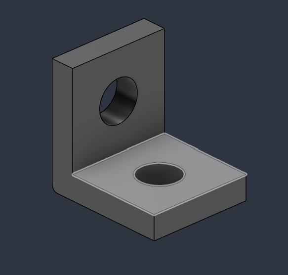
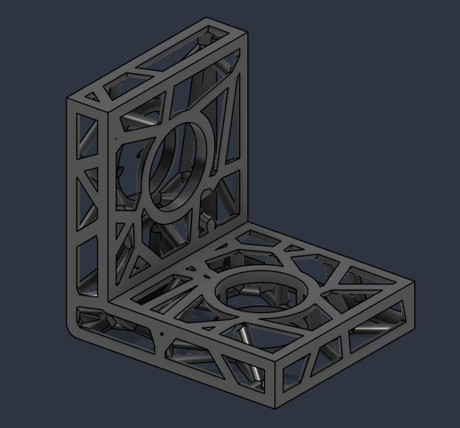

# Voronoi Converter for Autodesk Fusion

A Python script for fusion360 that transforms an existing solid body into a three-dimensional voronoi pattern.

## Installation 

1. Clone this repository 
2. In fusion 360, open the Utilities tab
3. Click "Add-ins" and then "Scripts and add-ins"
4. Click on the "+" button at the top of the window
5. Select "Script or add-in from device"
6. Select the folder where you clonned the repository

## Usage 

Now that the script is already installed, open "Scripts and add-ins" tab either by pressing (shift + s) or following the same steps as the installation until you have the tab opened. Look for the script "VoronoiConverter" and click on the sideways triangle to run it.

## Notes

The current script works better with geometric models. Support for highly organic or rounded shapes is planned for future updates.
First load may take a while since it needs to download scipy into fusion's native python enviroment.
Also expect it to take some time to convert your body, specially if you make it dense (a lot of seeds) or if it has a lot of faces.

## Showcase

Before:

After:

## License

[MIT](https://choosealicense.com/licenses/mit/)